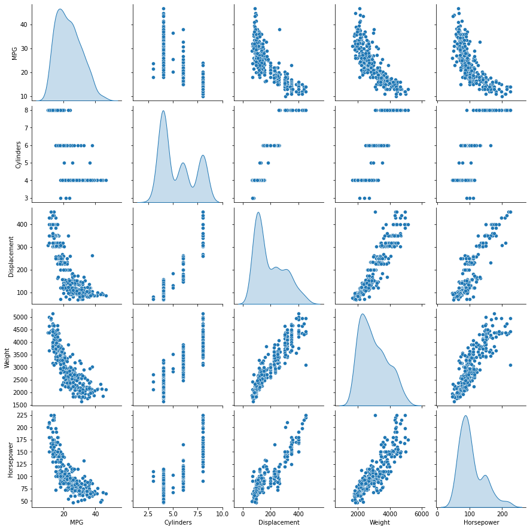
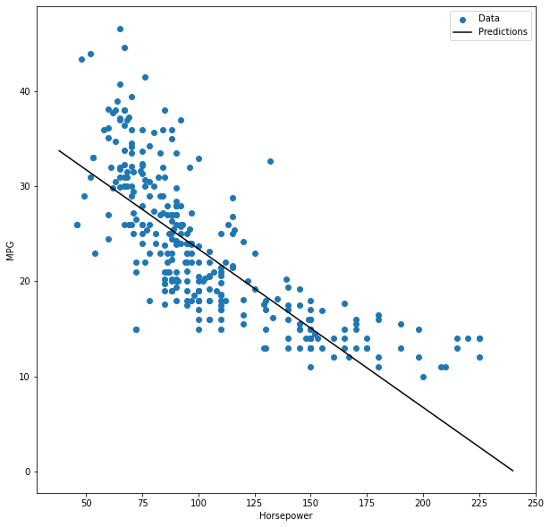
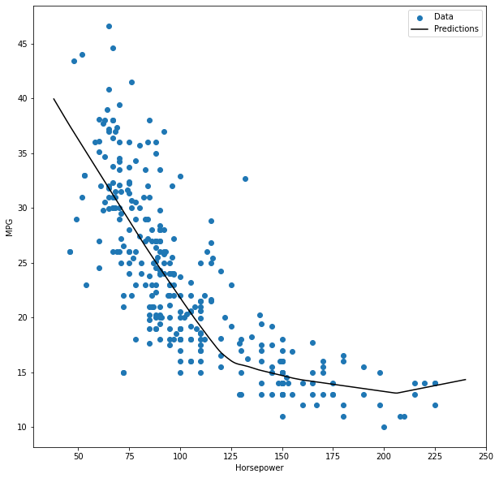

# Auto_MPG_project

## Regression problem: 
In a regression problem, the aim is to predict the output of a continuous value, like a price or a probability. 
Contrast this with a classification problem, where the aim is to select a class from a list of classes (for example, where a picture contains an apple or an orange, recognizing which fruit is in the picture).

## [Dataset](https://archive.ics.uci.edu/ml/datasets/auto+mpg): 

This tutorial uses the classic Auto MPG dataset and demonstrates how to build models to predict the fuel efficiency of the late-1970s and early 1980s automobiles. To do this, you will provide the models with a description of many automobiles from that time period. 
This description includes attributes like cylinders, displacement, horsepower, and weight.

## Project steps:

### 1. Data Exploration. 
* The top row suggests that the fuel efficiency (MPG) is a function of all the other parameters.

### 2. Preprocessing: mainly cleaning and convert categorical values [one hot encoding](https://en.wikipedia.org/wiki/One-hot).
### 3. Data splitting
### 4. Creating the models
#### a. Single feature with linear regression.
The plot of the HorsePower feature with MPG.

#### b. Multiple features with liner regression.
#### c. Single feature with DNN.
The plot of the HorsePower feature with MPG.

#### d. Multiple features with DNN.
       
### Performance Results

|Mean absolute error [MPG] |Mean absolute error [MPG]|
|:-------------------------|------------------------:|
|Single_feature_Regression |	3.644525          |
|linear_model_MultipInputs |	3.364622          |
|dnn_model_single_input    |	2.910135          |
|dnn_mi	             |       2.734736          |
|reloaded	             |       2.734736          |

### Referances:
1. [Basic regression: Predict fuel efficiency](https://www.tensorflow.org/tutorials/keras/regression#the_auto_mpg_dataset).
2. [04_regression, tensorflow-course](https://github.com/python-engineer/tensorflow-course/blob/master/04_regression.ipynb)
